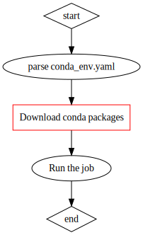

# Combined Together

## Setup the computing environment 

In addition to running locally, snakemake can submit jobs to a Kubernetes cluster. The jobs will be run in Docker containers encapsulated as _pods_ \([https://kubernetes.io/docs/tutorials/kubernetes-basics/explore/explore-intro/](https://kubernetes.io/docs/tutorials/kubernetes-basics/explore/explore-intro/)\). You are required to tell snakemake which Docker image to use through the argument `--container-image` \(you also have to include the flag `--kubernetes` to tell snakemake this is a Kubernetes run rather than a local run\):

```text
snakemake -s main.smk --kubernetes --container-image DOCKER_IMAGE_ID ...
```

You can arbitrarily choose any Docker image provided that:

* A working snakemake environment should be included
* All the tools required by the task should be included

There are two different approaches to provide needed tools and packages in the Docker image: via Conda, and directly build the packages into the image.

### Conda

Snakemake has built-in support for jobs using conda as the package management tool. For example, you may prepare the conda environment file and the snakemake rule specification as follows:

```yaml
# Conda environment specs: conda_env.yaml

channels:
    - conda-forge
    - bioconda
    - defaults
dependencies:
    - sra-tools =2.10
    - samtools =1.7
    - ucsc-wigtobigwig =357
    - ucsc-bedgraphtobigwig =357
    - bedops =2.4.37
```

```yaml
# main.smk

rule sam2bam:
    input: "sample.sam"
    output: "sample.bam"
    conda: "conda_env.yaml"
    shell:
        """
        samtools view -b {input} > {output}
        """
```

Notice that through the `conda` directive, `sam2bam` indicates to use a conda environment defined by `conda_env.yaml`.

Then invoke snakemake with the flag `--use-conda`:

```text
snakemake -s main.smk --use-conda
```

The steps for performing the job can be demonstrated as:



**Pros:**

* It's clear and easy to specify needed packages
* You can leverage the full power of conda as a package management tool
* It perfectly follows the _reproducible study_ philosophy

**Cons:**

* One major disadvantage is the downloading step \(marked with red\). Because each pod starts as a fresh one, therefore it needs to download and install packages prior to the actual job run. This sometimes can be very time-consuming.

### Built into Docker images

A workaround is building every essential packages into a Docker image and tells snakemake to use it. Although it violates the _reproducible study_ guideline to some degree, and only allows you to review the package list in an indirect way \(by investigating the Dockerfile\), it is sometimes the only _practical_ solution.

I would recommend you to build the Docker image from conda images such as `continuumio/miniconda3:4.8.2`. An example of Dockerfile is shown below:

```text
FROM continuumio/miniconda3:4.8.2

RUN apt-get update
RUN apt-get install -y curl

RUN conda config --add channels defaults && conda config --add channels bioconda && conda config --add channels conda-forge
RUN conda install -y snakemake=5.14.0

RUN conda install -y trimmomatic=0.39
RUN conda install -y picard=2.22.3
RUN conda install -y bwa=0.7.17
RUN conda install -y bedtools=2.29.2
RUN conda install -y bamtools=2.5.1
RUN conda install -y fastqc=0.11.9
RUN conda install -y samtools=1.10
RUN conda install -y pigz=2.4
```

### Use customized AMIs

To further expedite pods initialization, you may even go further by building your own AMI with the Docker image included. In this way, when the pod starts up, it doesn't need to pull the Docker image, which sometimes can go as large as a few giga bytes, because it's already exists in the system.

Create or update node groups like this:

```yaml
- name: ng-computing-4xlarge
    ami: ami-09afaac30c44a6fdf
    instancesDistribution:
        instanceTypes:
            - c5.4xlarge
            - c5d.4xlarge
            - c4.4xlarge
            - m5n.4xlarge
        spotAllocationStrategy: "capacity-optimized"
```


AMI stands for **A**mazon **M**achine **I**mages. It's the template for starting new EC2 instances. For more information about what AMI is and how to build them, refer to:  
[https://docs.aws.amazon.com/AWSEC2/latest/UserGuide/AMIs.html](https://docs.aws.amazon.com/AWSEC2/latest/UserGuide/AMIs.html)


## Working directory

By default, when invoking snakemake from command line, the current directory, as returned by `$(pwd)`, will be deemed as the _working directory_. This behavior has several impacts:

First, the path to all input files, output files, and log files, are relative to the working directory, unless they're referred by absolute paths.

In addition, snakemake will create a `.snakemake` folder in the working directory, and stores tons of metadata and other information in it, such as: locks, jobs status & tracking, conda environment if ever invoked with `--use-conda`, various of temporary files, log files, singularity images if ever invoked with `--singularity`, etc.

If you fail to run snakemake consistently from a certain directory, you may end up with lots of `.snakemake` directories. This is rather annoying, eats up a large amount of storage, and more importantly, it's the source of many subtle bugs, especially when race conditions are involved.

I suggest for each project, **always** run snakemake from the same directory. One prudent choice is using the _project home_. This can be done the `-d` argument:

```text
snakemake -d $PROJECT_HOME -s main.smk
```

Another reason for choosing the project home as the working directory is related to how snakemake upload source files to Kubernetes pods. This will be discussed in the next section.

## How source files are collected

_The discussion here applies when working with a Kubernetes cluster._

When working with Kubernetes, the jobs take place in the pods rather than in the local system. Therefore, it's crucial to have every piece of files to be present in the pod container,  and in a way that your commands can locate them.

* For input and output files, snakemake will download them from S3 before the job starts,    and upload them to S3 if the job completes successfully. ✔️
* For external tools, such as samtools, bwa, gatk, you can either install them via conda or build them into the Docker image, as discussed above. ✔️

It's much more complicated when you need to include your own source files, such as your Rscripts, or your home-made, actively-under-development programs. Since they are in the development phase, it's not appropriate to submit them to some package channels, or build them in the Docker image, which is only suitable for mature programs.

Fortunately, snakemake has a way of collecting source files \(although hardly documented\):


Source codes:  
[https://github.com/snakemake/snakemake/blob/v5.14.0/snakemake/workflo  
w.py\#L230](https://github.com/snakemake/snakemake/blob/v5.14.0/snakemake/workflow.py#L230)


```python
def get_sources(self):
    files = set()

    def local_path(f):
        url = urlparse(f)
        if url.scheme == "file" or url.scheme == "":
            return url.path
        return None

    def norm_rule_relpath(f, rule):
        if not os.path.isabs(f):
            f = os.path.join(rule.basedir, f)
        return os.path.relpath(f)

    # get registered sources
    for f in self.included:
        f = local_path(f)
        if f:
            files.add(os.path.relpath(f))
    for rule in self.rules:
        script_path = rule.script or rule.notebook
        if script_path:
            script_path = norm_rule_relpath(script_path, rule)
            files.add(script_path)
            script_dir = os.path.dirname(script_path)
            files.update(
                os.path.join(dirpath, f)
                for dirpath, _, files in os.walk(script_dir)
                for f in files
            )
        if rule.conda_env:
            f = local_path(rule.conda_env)
            if f:
                # url points to a local env file
                env_path = norm_rule_relpath(f, rule)
                files.add(env_path)

    for f in self.configfiles:
        files.add(f)

    # get git-managed files
    # TODO allow a manifest file as alternative
    try:
        out = subprocess.check_output(
            ["git", "ls-files", "."], stderr=subprocess.PIPE
        )
        for f in out.decode().split("\n"):
            if f:
                files.add(os.path.relpath(f))
    except subprocess.CalledProcessError as e:
        if "fatal: not a git repository" in e.stderr.decode().lower():
            logger.warning(
                "Unable to retrieve additional files from git. "
                "This is not a git repository."
            )
        else:
            raise WorkflowError(
                "Error executing git:\n{}".format(e.stderr.decode())
            )

    return files
```

The `Workflow` object collects files from the following sources:

* The snakemake file
* \(Optional\) conda environment specification
* \(Optional\) scripts if in the rule specification, you use the `script` directive rather than `shell`
* All files returned by `git ls-files .` , called from the _working directory_

These files will be registered as pod secrets and uploaded to the cluster.


Source code:  
[https://github.com/snakemake/snakemake/blob/v5.14.0/snakemake/executors.py\#L1392](https://github.com/snakemake/snakemake/blob/v5.14.0/snakemake/executors.py#L1392)



However, pay attention to this treacherous pitfall:

The files are not uploaded by common file-transfer protocols, but registered as pod secrets. Originally, by design, pod secrets is a mechanism used to transfer small chunks of secret data, such as tokens and keys. They're transferred by openssl via a secure channel. Due to the limitation of openssl library, if there are any large files \(&gt;1MB\) returned by `git ls-files .`, snakemake will fail.

I've submitted bug fixes and patches. Hopefully this can be fixed in the next release.


This is the reason why I suggest using the project home as the working directory, or at least be aware of the mechanism under the hood, so that you can include your source files in a more predictable way.


