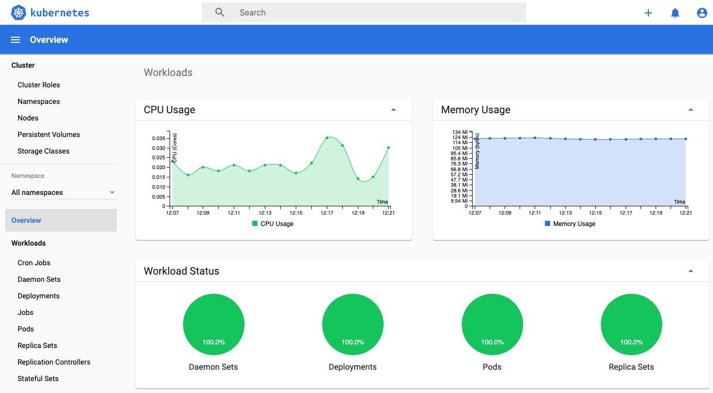

# Kubernetes/EKS

## Kubernetes

### Basics

**Managing nodes**

* List nodes: `kubectl get nodes -o wide`
* Label nodes: `kubectl label nodes -l alpha.eksctl.io/nodegroup-name=ng-1 new-label=foo`
* Show node labels: `kubectl get nodes --show-labels`
* List services: `kubectl get svc`

### Logging

Kubernetes doesn't provide native logging supports. For those log streams for stdout and stderr originated from a certain container, Docker will redirect them to a logging driver configured in Kubernetes. Hence you can use the command `kubectl logs` to retrieve them.

However, in the case when a pod ends, no matter if it crashes or successfully completed, the logs won't be accessible after the pod's lifecycle ends. Under some circumstances, this might be a huge hurdle for troubleshooting.

I recommend implementing a cluster-level logging mechanism, which persistently keeps all logs from all the pods in which you feel interested. There are several ways to achieve that. A recommended stacks is a fluentd DaemonSet working at the node-level for each node, and an external ElasticSearch logging database.



See this tutorial: [https://medium.com/kubernetes-tutorials/cluster-level-logging-in-kubernetes-with-fluentd-e59aa2b6093a](https://medium.com/kubernetes-tutorials/cluster-level-logging-in-kubernetes-with-fluentd-e59aa2b6093a)


## EKS

EKS \(AWS **E**lastic **K**ubernetes **S**ervice\) is a Kubernetes cluster service managed by AWS. The following commands need AWS CLI to be installed and configured. 


Refer to: [https://aws.amazon.com/cli/](https://aws.amazon.com/cli/)


### Create an EKS cluster

EKS clusters can be created via `eksctl`:

```bash
eksctl create cluster -f cluster.yaml
```

The command requires a cluster definition file to be present \(`cluster.yaml`\), which is the recommended way providing configuration information:

```yaml
# cluster.yaml

apiVersion: eksctl.io/v1alpha5
kind: ClusterConfig

metadata:
  name: my-cluster
  region: us-east-2

nodeGroups:
  - name: ng-computing-4xlarge
    labels: { autoscaling: full }
    minSize: 0
    maxSize: 10
    ami: ami-09afaac30c44a6fdf
    volumeSize: 80
    iam:
        withAddonPolicies:
            autoScaler: true
    instancesDistribution:
        instanceTypes:
            - c5.4xlarge
            - c4.4xlarge
            - m5n.4xlarge
        spotAllocationStrategy: "capacity-optimized"
        maxPrice: 0.2
        onDemandBaseCapacity: 0
        onDemandPercentageAboveBaseCapacity: 100
  - name: ng-general
    instanceType: t3.medium
    iam:
        withAddonPolicies:
            autoScaler: true
    desiredCapacity: 1
```

The above example creates an EKS cluster with two node groups:

* `ng-computing-4xlarge`: a node group that consists of 0~10 spot instances from a diverse group, each one comes with a 80GB volume.
* `ng-general`: a node group of only 1 ordinary instance. It's a relatively small instance \(t3.medium\). The desired capacity is always 1, meaning auto-scaling is turned off. The purpose of this node group is providing an _always-online_ instance, which runs essential Kubernetes services, i.e. the dashboard service, the cluster auto-scaler, the log collector, etc.


By default, `onDemandBaseCapacity=0` and `onDemandPercentageAboveBaseCapacity=100` which means if you leave these two settings unmodified, you will get a number of onDemand instances, and no spot instances at all. Maybe this is not what you want.

For more details: [https://eksctl.io/usage/spot-instances/](https://eksctl.io/usage/spot-instances/)



For more information about spot instances: [https://aws.amazon.com/ec2/spot/](https://aws.amazon.com/ec2/spot/)


### Types of node groups

There are two types of node groups: managed, and self-managed.

#### Managed node group

> Amazon EKS managed node groups automate the provisioning and lifecycle management of nodes \(Amazon EC2 instances\) for Amazon EKS Kubernetes clusters.


Refer to: [https://docs.aws.amazon.com/eks/latest/userguide/managed-node-groups.html](https://docs.aws.amazon.com/eks/latest/userguide/managed-node-groups.html)


To list managed node groups:

```bash
eksctl get nodegroup --cluster=my-cluster
```


Managed node group doesn't support two key features:

* Using customized AMI. It means that each node, when initialized, is a vanilla one. To perform any tasks, it has to pull the docker image from registry, and do some initialization work. This can be time-consuming, and can be a waste of the bandwidth.
* Supporting spot instances. Although this is a scheduled feature \(more discussion can be found at: [https://github.com/aws/containers-roadmap/issues/583](https://github.com/aws/containers-roadmap/issues/583)\), currently it only works with ordinary instances.


#### Self-managed node group

Due to the limitation, the example above employs only self-managed node groups.

You cannot list self-managed node groups using `eksctl get nodegroup`. Instead, please go to [https://console.aws.amazon.com/cloudformation/home](https://console.aws.amazon.com/cloudformation/home) 

Each node group is listed as a _stack_ \([https://docs.aws.amazon.com/AWSCloudFormation/latest/UserGuide/stacks.html](https://docs.aws.amazon.com/AWSCloudFormation/latest/UserGuide/stacks.html)\):

### Create a node group

```bash
eksctl create nodegroup --config-file=cluster.yaml --exclude '*' \
    --include 'new-node-group-name'
```

### Delete a node group

```bash
eksctl delete nodegroup --config-file=cluster.yaml --exclude '*' \
    --include 'node-group-to-delete' --approve
```

### Generate configuration for an existing Kubernetes cluster

`eksctl` is a command provided by AWS CLI, which loads configuration information in the same way as `aws` does, i.e. from the environment variables and `~/.aws`, any operations involving Kubernetes APIs requires that `~/.kube/config` is correctly configured:

* `kubectl` the command line tool 
* snakemake called with argument `--kubernetes` 

If you have access to an existing Kubernetes cluster, you can generate the `~/.kube/config` file following the instructions: 

[https://docs.aws.amazon.com/eks/latest/userguide/create-kubeconfig.html](https://docs.aws.amazon.com/eks/latest/userguide/create-kubeconfig.html)

### Deploy a Kubernetes dashboard

A dashboard is very helpful to monitor and update your Kubernetes cluster.



Instructions:

[https://docs.aws.amazon.com/eks/latest/userguide/dashboard-tutorial.html](https://docs.aws.amazon.com/eks/latest/userguide/dashboard-tutorial.html)

### Deploy the auto-scaling mechanism

We can use CAS \(Cluster Auto-Scaler\) to achieve auto-scaling. 


To install Cluster Autoscaler, refer to the tutorial:  
[https://docs.aws.amazon.com/eks/latest/userguide/cluster-autoscaler.html\#ca-ng-considerations](https://docs.aws.amazon.com/eks/latest/userguide/cluster-autoscaler.html#ca-ng-considerations)

More information can be found at:  
[https://github.com/kubernetes/autoscaler/blob/master/cluster-autoscaler/cloudprovider/aws/README.md](https://github.com/kubernetes/autoscaler/blob/master/cluster-autoscaler/cloudprovider/aws/README.md)


Here are some take-away summaries:

First, ensure the node group has sufficient permissions. In the `cluster.yaml` configuration file, the node groups should be defined with:

```yaml
iam:
  withAddonPolicies:
    autoScaler: true
```

Further more, to  The ASG is properly tagged. This can be done in the EC2 console:


Furthermore, if you need to auto-scale from and to 0 node, you have to tag the auto-scaling group \(ASG\) as follows:

```text
k8s.io/cluster-autoscaler/node-template/label/foo=bar
```

Where the nodes are labeled as `foo=bar`. 

In our example, the computing node group is labeled as: `labels: { autoscaling: full }`, therefore, the ASG should be properly tagged as: 

```text
k8s.io/cluster-autoscaler/node-template/label/autoscaling=full
```


For more information:  
[https://github.com/kubernetes/autoscaler/tree/master/cluster-autoscaler/cloudprovider/aws\#scaling-a-node-group-to-0](https://github.com/kubernetes/autoscaler/tree/master/cluster-autoscaler/cloudprovider/aws#scaling-a-node-group-to-0)


By default, Cluster Autoscaler waits for 10 min before starting scaling down unneeded nodes. This behavior can be overwritten as below:

```text
--scale-down-delay-after-add duration                      How long after scale up that scale down evaluation resumes (default 10m0s)
--scale-down-delay-after-delete duration                   How long after node deletion that scale down evaluation resumes, defaults to scanInterval (default 10s)
--scale-down-delay-after-failure duration                  How long after scale down failure that scale down evaluation resumes (default 3m0s)
--scale-down-non-empty-candidates-count int                Maximum number of non empty nodes considered in one iteration as candidates for scale down with drain.Lower value means better CA responsiveness but possible slower scale down latency.Higher value can affect CA performance with big clusters (hundreds of nodes).Set to non posistive value to turn this heuristic off - CA will not limit the number of nodes it considers. (default 30)
--scale-down-unneeded-time duration                        How long a node should be unneeded before it is eligible for scale down (default 10m0s)
--scale-down-unready-time duration                         How long an unready node should be unneeded before it is eligible for scale down (default 20m0s)
--scale-down-utilization-threshold float                   Node utilization level, defined as sum of requested resources divided by capacity, below which a node can be considered for scale down (default 0.5)
```

### Work with Spot Instances

EC2 Spot Instance is a special kind of EC2 instances, which make use of idle computing resources across the EC2 pool, thus providing deep discounts compared with OnDemand EC2 instances. However, Spot Instances can be interrupted based on demand and availability. When AWS determines to interrupt a spot instance, it sends a two-minute notification. For our snakemake/Kubernetes system, it's important to handle the interruption notification properly, at least:

* Taint the node
* Try gracefully terminate the snakemake job within

Here is a simplified workflow for deploying the handler:


[https://eksworkshop.com/beginner/150\_spotworkers/deployhandler/](https://eksworkshop.com/beginner/150_spotworkers/deployhandler/)


In a nutshell, what it does is simple: deploying daemon sets which keep listening to the interruption notification endpoint. Upon receiving interruption notices, they will try to drain the node.

In addition, you can also subscribe the interruption notification through CloudWatch.

### Spot Instance Termination Handler

AWS Spot Instances are supposed to be ephemeral, meaning that AWS may terminate them any time when the underlying EC2 pool resource is limited.

A good practice is deploying a DaemonSet watching the 2-minute termination, and gracefully handle the event upon receiving the notice. Try: [https://github.com/aws/aws-node-termination-handler](https://github.com/aws/aws-node-termination-handler)

Notice: maybe you want to use the `cordonOnly` flag, because we are running snakemake jobs, and we in fact don't need draining and eviction. A simple _let-it-fail_ strategy may serve better.

## Elasticsearch/Kibana for Logging


Digital Ocean has a very good tutorial about deploying Elasticsearch/Kibana in a Kubernetes cluster:  
[https://www.digitalocean.com/community/tutorials/how-to-set-up-an-elasticsearch-fluentd-and-kibana-efk-logging-stack-on-kubernetes\#step-1-%E2%80%94-creating-a-namespace](https://www.digitalocean.com/community/tutorials/how-to-set-up-an-elasticsearch-fluentd-and-kibana-efk-logging-stack-on-kubernetes#step-1-%E2%80%94-creating-a-namespace)


However, the tutorial is for general Kubernetes clusters. There are a few consideration when you want to implement that in an EKS cluster.

### Persistent volumes

By default, Kubernetes pods use ephemeral storage, which means when the lifecycle of pod ends, the stored data goes as well. Of course, this won't be the expected behavior of any database systems. You need to configure persistent volumes for Elasticsearch stateful sets.

In EKS, persistent volume provision can be fulfilled in two ways: EBS and EFS. EFS stands for Elastic File System, which works like a network file system \(NFS\). However, it's much more expensive compared with EBS. For this reason, here we want to configure the persistent volume provision through EBS.


Detailed guide for the configure:  
[https://aws.amazon.com/premiumsupport/knowledge-center/eks-persistent-storage/](https://aws.amazon.com/premiumsupport/knowledge-center/eks-persistent-storage/)  
[https://docs.aws.amazon.com/eks/latest/userguide/ebs-csi.html](https://docs.aws.amazon.com/eks/latest/userguide/ebs-csi.html)


To sum up, you need:

* Deploy the EBS CSI driver
* Create the storage class
* Configure the persistent volume claim template

To create the storage class:

```text
kind: StorageClass
apiVersion: storage.k8s.io/v1
metadata:
  name: ebs-sc
provisioner: ebs.csi.aws.com
volumeBindingMode: WaitForFirstConsumer
```

Now you can instruct the stateful set to make the PVC:

```text
apiVersion: apps/v1
kind: StatefulSet
metadata:
  name: es-cluster
  namespace: kube-logging
spec:
  serviceName: elasticsearch
  replicas: 3
  selector:
    matchLabels:
      app: elasticsearch

# ...

  volumeClaimTemplates:
  - metadata:
      name: data
      labels:
        app: elasticsearch
    spec:
      accessModes: [ "ReadWriteOnce" ]
      storageClassName: ebs-sc
      resources:
        requests:
          storage: 60Gi
```

You can also register a persistent volume claim \(PVC\) so that future pod specs can refer to it:

```text
apiVersion: v1
kind: PersistentVolumeClaim
metadata:
  name: elasticsearch-pv-claim
  labels:
    app: elasticsearch
spec:
  accessModes:
    - ReadWriteOnce
  storageClassName: ebs-sc
  resources:
    requests:
      storage: 60Gi
```

### Availability Zone

EKS nodes can be spread across multiple Availability Zones \(AZs\). This guarantees higher availability. However, one of the limitations of our Elasticsearch deployment is that, since AWS doesn't support cross-zone EBS attachment, you have to ensure the pods and and persistent volumes are within the same zone. Otherwise, Kubernetes will complain about mount failures.

This can be achieved by node selectors. In the stateful set specs:

```text
apiVersion: apps/v1
kind: StatefulSet
metadata:
  name: es-cluster
  namespace: kube-logging
spec:
  serviceName: elasticsearch
  replicas: 3
  selector:
    matchLabels:
      app: elasticsearch
  template:
    metadata:
      labels:
        app: elasticsearch
    spec:
      affinity:
        nodeAffinity:
          requiredDuringSchedulingIgnoredDuringExecution:
            nodeSelectorTerms:
            - matchExpressions:
              - key: ng
                operator: In
                values:
                - general
```

In the nodegroup specs:

```text
apiVersion: eksctl.io/v1alpha5
kind: ClusterConfig

metadata:
  name: epifluid-cluster
  region: us-east-2

nodeGroups:
  - name: ng-general-extra
    labels:
        autoscaling: full
        ng: general
    volumeSize: 40
    ssh:
        allow: true
    iam:
        withAddonPolicies:
            autoScaler: true
    availabilityZones:
        - us-east-2c
    instancesDistribution:
        instanceTypes:
            - t3.medium
            - t2.medium
            - m5n.large
            - c5.large
            - c5d.large
        spotAllocationStrategy: "capacity-optimized"
        OnDemandBaseCapacity: 1
        onDemandPercentageAboveBaseCapacity: 0
    minSize: 1
    maxSize: 5

```

In this example, the nodegroup `ng-general-extra` come with a label: `ng=general`, and we also specifies the same node affinity in the stateful set specs. This ensures that all `es-cluster` pods will be associated to `ng-general` nodes, which are always located in us-east-2c.

