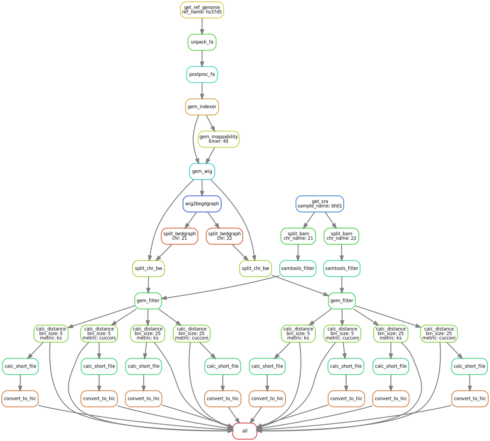

# Snakemake

## Installation

There are a few ways to install snakemake: [https://snakemake.readthedocs.io/en/stable/getting\_started/installation.html](https://snakemake.readthedocs.io/en/stable/getting_started/installation.html)

I would recommend using Conda for the installation:

```bash
conda install -c conda-forge -c bioconda snakemake=5.14.0
```

## Define the Workflow



The fundamental concept of snakemake is defining your workflow by specifying the following three core elements for each rule:

* What is the input?
* What is the output?
* What to do?

The dependencies can be inferred from the input-output relationship. The workflow is essentially nothing but a DAG \(Directed acyclic graph, [https://en.wikipedia.org/wiki/Directed\_acyclic\_graph](https://en.wikipedia.org/wiki/Directed_acyclic_graph)\).

### Adaptive-adjusted resource requests

Snakemake rules can demand certain resources they feel needed:

```yaml
rule foo:
    threads: 8
    resources:
        mem_mb=2048
        disk_mb=4096
```

Run snakemake using arguments `--cores/--jobs/-j`:

```text
snakemake --cores 32 -s main.smk foo
```

The rule specifies that it needs 8 logical CPU cores, 2GB memory and 4GB disk space. Furthermore, `--cores 32`  tells snakemake scheduler the total number of available CPU cores is 32, so it can make arrangements accordingly, by solving a knapsack problem \([https://github.com/snakemake/snakemake/blob/v5.14.0/snakemake/scheduler.py\#L488](https://github.com/snakemake/snakemake/blob/v5.14.0/snakemake/scheduler.py#L488)\).

Sometimes it's not possible to tell exactly how much resource a job needs in advance. In this case, you can use lambda functions to dynamically determine resource needs:

```yaml
rule foo:
    threads: 8
    resources:
        mem_mb=lambda wildcards, attempt: attempt * 2000
```

And run snakemake with `--restart-times 3`, which means if a job fails, snakemake will try to restart it up to three times. Each time, the memory needs will be increased by 2000MB \(`attempt * 2000`\).

### Handle remote files

Each snakemake rule may have input and output files. They can be either local files or remote files. Currently, snakemake supports a few cloud storage providers: AWS S3, GS, SFTP/FTP, to name a few.

* For remote input files, snakemake will download them prior to running the rule.
* For remote output files, snakemake will upload them if the job is completed successfully.

This cookbook focuses on working with S3 remote files. There are two ways to declare remote files: explicitly and implicitly.

For more information, please refer to [https://snakemake.readthedocs.io/en/stable/snakefiles/remote\_files.html](https://snakemake.readthedocs.io/en/stable/snakefiles/remote_files.html)

#### The explicit way

You can explicitly tell snakemake a file is a remote one rather than a local one:

```python
# Initialize the S3 client at the beginning of the snakemake file
from snakemake.remote.S3 import RemoteProvider as S3RemoteProvider

# Requires aws cli configured, otherwise you have to explicitly provide the credentials (not recommended)
S3 = S3RemoteProvider()
```

The previous example requires AWS CLI is correctly configured in your system, via environment variables, `~/.aws/credentials` configure files, etc. See: [https://docs.aws.amazon.com/cli/latest/userguide/cli-chap-configure.html\#config-settings-and-precedence](https://docs.aws.amazon.com/cli/latest/userguide/cli-chap-configure.html#config-settings-and-precedence)

If this is not the case, you can hard-code the access key and secret key during the initialization. But this is **highly discouraged** due to security issues:

```python
S3 = S3RemoteProvider(access_key_id="MYACCESSKEY", secret_access_key="MYSECRET")
```

After initializing the S3 object, you can refer to S3 files in the input/output specification:

```yaml
ruel bwa:
    input: S3.remote("bucketname/fastq/sample.fq.gz")
    output: S3.remote("bucketname/bam/sample.bam")
    shell: "bwa mem ... ... {intput} {output}"
```

Snakemake ensures the FASTQ file will be downloaded and the BAM file will be uploaded to S3.

#### The implicit way

There is one problem with the explicit way: the snakemake file is sort of hard-coded with S3, and only works with S3 remote files. What if you want to apply the workflow to a few local FASTQ files? What if you want to work with FASTQ files residing in an FTP server?

Your are forced to modify the snakemake rule specification on the fly, and hard-coding is the source of many bugs.

Let's look at the implicit way:

```yaml
# main.smk

ruel bwa:
    input: "fastq/sample.fq.gz"
    output: "bam/sample.bam"
    shell: "bwa mem ... ... {intput} {output}"
```

If you only need to process local files, simply run snakemake as usual:

```text
snakemake -s main.smk bwa
```

It assumes this is a local job, and all the input and output files are located locally, under the directory `./fastq` and `./bam`, respectively.

However, when you run snakemake with two additional arguments, `--default-remote-provider` and `--default-remote-prefix`:

```bash
snakemake --default-remote-provider S3 --default-remote-prefix \
  bucket_name/project_dir -s main.smk bwa
```

Under the hood, snakemake will implicitly apply the prefix to each file declaration, unless it's explicitly declared. In the very example, snakemake equivalently assumes the following:

```yaml
input: S3.remote("bucket_name/project_dir/fastq/sample.fq.gz")
output: S3.remote("bucket_name/project_dir/bam/sample.bam")
```

Notice that `--default-remote-prefix`can be not only the bucket name, but any sub-directories \(`/project_dir/`\) as well.

One more question: how to specify the target by file names, rather than the rule name:

```bash
snakemake --default-remote-provider S3 --default-remote-prefix \
  bucket_name/project_dir -s main.smk bucket_name/project_dir/bam/sample.bam
```

Notice that although in the rule specification, the output is just `bam/sample.bam`, when invoke snakemake from command line, you have to specify the **full file location**. This is because snakemake can only apply the remote prefix to rules within the specification, not to files specified in the command line.

## Work with SLURM

Snakemake has native support for cluster job submission: [https://snakemake.readthedocs.io/en/stable/executing/cluster-cloud.html\#cluster-execution](https://snakemake.readthedocs.io/en/stable/executing/cluster-cloud.html#cluster-execution)

This document won't talk about submitting SLURM jobs in details, but just provide an example.

The argument `--cluster` refers to the job submission command. For PSC, this means `sbatch`.

However, usually you may also want to specify options for `sbatch`. They can be for the entire workflow, or just rule-specific fine controls \(for example, some rules require more CPUs than others, so a cost-effective way is allocating more cores for this rule only\). This can be achieved by specifying a configuration file through `--cluster-config`. \(It's deprecated but still working for v5.13.0\)

An example of `cluster_config.yaml`:

```yaml
# cluster_config.yaml

__default__:
  partition: RM-shared
  mail_user: haizi.zheng@cchmc.org
  nodes: 1
  cpus_per_task: 1
  ntasks_per_node: 1
  mail_type: ALL
  constraints: EGRESS
  wall_time: "12:00:00"

sort_bam:
  cpus_per_task: 28

gem_mappability:
  ntasks_per_node: 28
```

Default `sbatch` options are placed under `__default__`, and rule-specific options are placed under each section.

To refer to the customized options, update the `--cluster` argument as follows. Curly brackets are placeholder for the options defined in `cluster_config.yaml`:

```bash
snakemake --jobs 999 --cluster-config cluster_config.yaml \
  --cluster "sbatch -C {cluster.constraints} -t {cluster.wall_time} \
             --partition={cluster.partition} --mail-user={cluster.mail_user} \
             --mail-type={cluster.mail_type} --nodes={cluster.nodes} \
             --ntasks-per-node={cluster.ntasks_per_node} \
             --cpus-per-task={cluster.cpus_per_task}" \
             -s bam_per_chr.consolidated.smk --cores 28 --use-conda \
             -np works/samtools_filter/bh01.chr{17,18}.filtered.bam
```

## Default rule

If you invoke snakemake without specifying a default target, snakemake will use the first rule. It's convenient to put a dummy rule at the beginning, named `all`, to simply requesting input files without doing any actual computing. In this way, it _collects_ certain output files, thus triggering other jobs.

Example:

```yaml
rule all:
    input:
        "bam/sample_1.bam",
        "bam/sample_2.bam"
        
rule bwa:
    input: 
        - "bam/{sample_id}.fastq.gz"
        - "ref/some_ref_genome.fa.gz"
    output: "bam/{sample_id}.bam"
    shell:
        """
        do_something > {output}
        """
```

You can invoke snakemake like this:

```bash
snakemake -s main.smk
```


